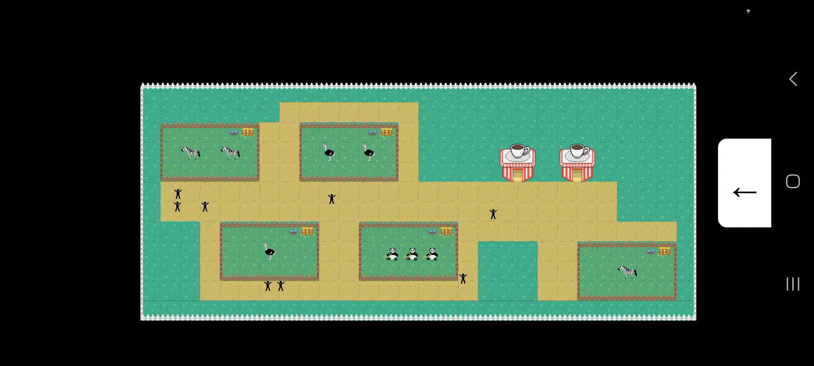

# Mon petit Zoo - KONE Zeinabou, JANDOT Floriane

Mon petit Zoo est un jeu de gestion, dit "GodGame", c'est à dire que l'utilisateur est en vue du dessus et peut poser divers éléments en se déplaçant sur le terrain.




## Fonctionnalités principales

### 1) Récupération du terrain

Pour récupérer du terrain dans notre application, nous utilisons **JSON Server** pour simuler une API REST. JSON Server nous permet de servir un fichier JSON comme s'il s'agissait d'un véritable backend ! (https://www.npmjs.com/package/json-server)

Une fois les données du terrain récupérées, elles sont stockées dans **Redux**, qui gère l'état global de l'application. Dans notre cas, il nous a servi à accéder aux terrain depuis plusieurs components sans utiliser les *contexts* qui sont de mauvaises pratiques.

 Les données du terrain sont donc initialisées dans le state de Redux après le **fetch (GET)** sur JSON server.

### 2) Modification des données

 Lorsque des modifications sont apportées au terrain (par exemple, ajout de nouvelles cases), ces changements sont également gérés par Redux. 

 Nous avons également voulu intégrer la sauvegarde à notre jeu : chaque modification appelle un **fetch (PUT)** qui vient mettre la nouvelle composition du terrain dans le JSON.

### 3) Placement des éléments

1) Placement des structures et animaux

Le placement des animaux et des structures sont principalement gérées par deux components, ModifierTerrainComponent et AjouterCaseComponent. Ils ont été pensés de manière très réutilisables.

Si, par exemple, je décide de rajouter un aquarium posable dans le zoo, il me suffit seulement de :
- Déposer les images de l'aquarium dans les assets
- Indiquer dans CaseService.tsx le nom de mon aquarium et comment sont organisées les images pour former la structure complète (sprite de droite, de gauche etc)
- Ajouter le bouton dans le menu pour poser mon aquarium

Tout le reste du code traite dynamiquement les données. Le code est le même pour un petit objet d'une case ou pour une grande structure.

2. Gestion du tactile 

React Native n'étant pas fait pour traiter de grands tableaux et encore moins pour des jeux vidéos, nous avons dû un peu ruser sur cette partie.

Pour le placement des animaux et structures, c'est l'utilisateur qui déplace un objet via **Animated**, une librairie native. Elle nous a permis de pouvoir déplacer la case comme si elle était au dessus de tous les autres components (cela évitait de regénérer le rendu) car il y avait énormément de lag.

Animated a été couplé avec un autre objet React Native, le **panResponder**. C'est lui qui nous a permis de traiter les comportements de l'utilisateur, notamment les coordonnées de mouvements d'une structure quand elle est déplacée.

Comme ces coordonées sont indépendantes de notre tableau terrain (c'est à dire que ce sont des floats), nous avons fait des calculs pour savoir sur quel case la structure serait la plus proche. À la fin, il nous suffit juste de vérifier si le sol est libre pour placer l'élément ; si non, on l'affiche en rouge, comme dans les jeux classiques de gestion.

3. Gestion des chemins

Cette partie a été un feu frustrante. Pour placer les chemins, il faut tracer de nouvelles cases avec le doigt et non en déplacer, donc il n'est pas possible d'utiliser Animated... C'est pour cela que la génération des chemins est extrêmement lente, malgré une optimisation de notre part. 

### Animation des bonhommes 

La marche des bonhommes a également été faite avec la librairie Animated.

L'algorithme de déplacement garantit que chaque bonhomme suit uniquement les chemins autorisés sur le terrain, ce qui est vérifié à chaque étape de son déplacement. Cela permet d'éviter que les bonhommes aillent par exemple, dans les enclos !

Lorsque les bonhommes atteignent une intersection ou un point de décision sur le chemin, ils choisissent aléatoirement la direction suivante à prendre.

Les animations ont été conçues pour être réactives et s'adaptent aux interactions de l'utilisateur avec l'application. Par exemple, si un utilisateur modifie le terrain en ajoutant de nouveaux chemins, les bonhommes ajusteront automatiquement leurs parcours pour prendre en compte ces changements.

### Images et animations

Les images et les gifs ont été réalisés par nos soins via l'application libre de droit Piskel.

### Petits mots d'une développeuse engagée

Compte tenu du respect animal et de la banalisation de l'enfermement d'animaux sauvages dans notre société,  nous ne soutenons pas le concept de parc zoologique dans le monde réel.


## Structure du projet :
```
.
├── src  
│   ├── assets  
│           ├── musique     (n'a pas été utilisé après 3 essais de librairies différentes)
│           ├── sols        # images et gifs
│   ├── components          # composants de l'application
│   ├── contexts            (n'a pas été utilisé)
│   ├── services            # fonctions appelées par les composants
│   ├── slices              # Redux
│   ├── store               # Redux
│   ├── type                # Définition des cases
│
└── App.js
└── db.json                 # Données du terrain pour le serveur 
```
